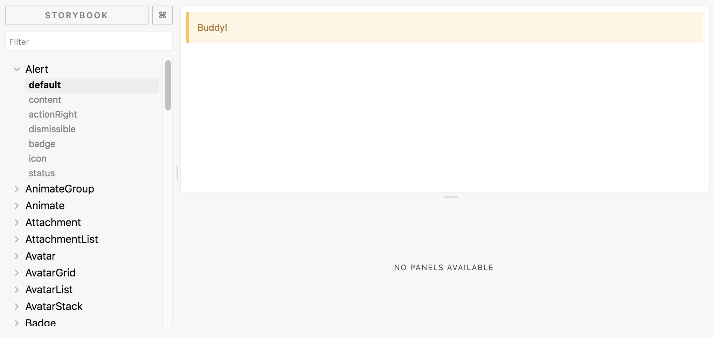

# Getting started

In this guide, we'll walk through how to get started with HSDS development.

## Setup

First, we need to clone the Github repo to your computer. Open up your terminal, and run this command in the directory of your choice:

```
git clone git@github.com:helpscout/hsds-react.git
```

Next, go into that directory:

```
cd hsds-react
```

And install all the dependencies in the world...

```
npm install
```

Note: You can use [Yarn](https://yarnpkg.com/en/) if you like, but it is recommended you use [npm](https://www.npmjs.com/), as that is what we use. This is to avoid install conflicts from `yarn.lock` vs `package-lock.json`.

Great 🌈! You've setup and installed all of HSDS's dependencies.

## Development environment



HSDS's development environment is powered by [Storybook](https://storybook.js.org/). To fire up HSDS's Storybook, run the following command:

```
npm start
```

HSDS's `start` does a neat thing that automatically checks and installs dependencies for you. After the initial `npm install`, you most likely don't need to do this anymore when running `npm start` 💪.

Once Storybook builds, you'll be able to visit it at [http://localhost:8900/](http://localhost:8900/).

The live version of HSDS's Storybook can be seen at [https://hsds-react.netlify.com/](https://hsds-react.netlify.com/).

Fantastic ✌️! You've got HSDS up and running on your computer.

## Code editor

You can use **whatever code editor you like**! HSDS is typed using [TypeScript](https://www.typescriptlang.org/). Because of this, we recommend using [Visual Studio Code](https://code.visualstudio.com/).

## Git branch

Create a new `git` branch for your work. You can call it whatever you like (the more descriptive of your work, the better):

```
git checkout -b strong-component
```

## Next

Let's [create our new component](creating.md) in HSDS!
