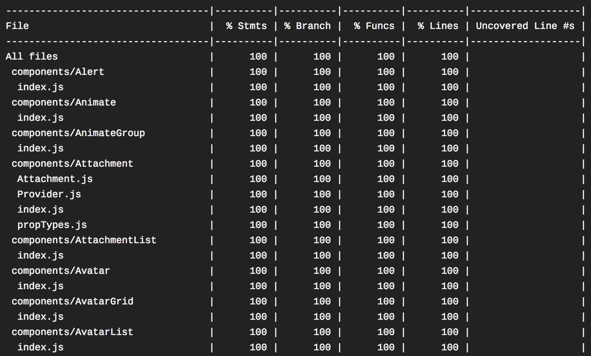

# Writing tests

In this guide, we'll walk through writing test for a custom `Input` component.

HSDS uses [Jest](https://jestjs.io/) as the testing framework and [React Testing Library](https://testing-library.com/) to write the actual tests.

We also have included the [User Event](https://www.npmjs.com/package/@testing-library/user-event) package to make writing tests that need simulating user events easier and more readable.

In the past we have used [Enzyme](https://github.com/airbnb/enzyme) for testing, and a lot of tests still uses it, but do try to write your tests using the above.

**Tips**

- Test the _output_ of your rendered components, [debug](https://testing-library.com/docs/react-testing-library/api#debug) is your friend.
- Avoid testing implementation details (internal `state` for example) that enzyme tends to encourage.
- [Check these guiding principles](https://testing-library.com/docs/guiding-principles)

## Directory

All of HSDS's component test files are scoped in the same directory as the component, example:

```
hsds-react/
  └── components/
      └── Input/
          └── Input.test.js
```

## Base test code

In our `Input.test.js` file, we'll need to add:

```jsx
import React from 'react'
import { render, waitFor } from '@testing-library/react'
import user from '@testing-library/user-event'
import Input from '../Input'

describe('Input', () => {
  test('Should render', () => {
    const { getByLabelText } = render(<Input name="user" />)

    expect(getByLabelText('user')).toBeInTheDocument()
    expect(getByLabelText('user').classList.contains('c-Input')).toBe(true)
  })

  // Example of a test with user interaction
  test('Should fire on change event when typing', async () => {
    const spy = jest.spy()
    const { getByLabelText } = render(<Input name="user" onChange={spy} />)
    const input = getByLabelText('user')

    user.type(input, 'hola')

    // You don't always need to "waitFor" after the event simulation
    await waitFor(() => {
      expect(input.value).toBe('hola')
      expect(spy).toHaveBeenCalled()
    })
  })
})
```

## Test development

For test development, open up your terminal and run the following command:

```
npm run dev
```

This fires up Jest in watch mode, and runs tests against modified files (and their associated files).

## Code coverage



To check code coverage, run the following command:

```
npm run test
```

This runs through the entire Jest test suite, and generates a [coverage report](https://istanbul.js.org/) under:

```
hsds-react/
  └── coverage/
      └── lcov-report/
          └── index.html
```

You can open the `index.html` in your browser to view the full report.

## Coverage

We strive to have as much coverage as posible, and for that purpose we set the threshold at 95% coverage.

Why not 100%? 100% coverage is a false metric and it does not indicate whether your component is _properly_ tested, and while we maintained 100% coverage for a long period we noticed an excessive usage of `istanbul ignore` directives, this wasn't because of lazyness but because some things are close to impossible to test in the Jest/JSDOM environment or because `istanbul` couldn't reach the code for some reason.

## Next

Let's [write some documentation](documentation.md) to make sure other folks know how to use `Strong`.

## See also

- [Jest](https://jestjs.io/)
- [React Testing Library](https://testing-library.com/)
- [User Event](https://www.npmjs.com/package/@testing-library/user-event)
- [Enzyme](https://github.com/airbnb/enzyme)
- [Istanbul](https://istanbul.js.org/)
- [Coveralls](https://coveralls.io/)
